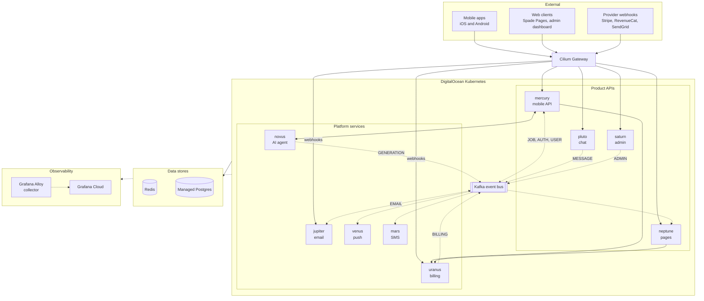

# Spade, The Platform Behind the Product

When we started Spade, the marketplace was only intended to be our first product.

The longer-term vision was an ecosystem of software for service businesses. We wanted to take over parts of running a company that providers didn't want to spend their time on, with products that could share data and capabilities instead of operating as independent applications. I often thought about Apple's ecosystem: each product is useful on its own, but much of the value comes from how well everything works together.

That vision influenced the backend from the beginning. Rather than building an application around a single product, I designed a platform around business domains and reusable capabilities.

By the time we shut it down, Spade ran nine Node.js/TypeScript application services on DigitalOcean Kubernetes, with Kafka, Redis, a managed PostgreSQL database, and a fairly complete observability stack. I was the only technical founder, so I owned the architecture end to end, from service boundaries and application code to deployments and production operations.

This is a look at what was running behind the scenes, why I structured it that way, and which trade-offs held up in practice.

## Designing around domains, not features

I settled on a **service-based architecture**: independently deployable, relatively coarse-grained services, each responsible for a recognizable business domain or platform capability.

I wasn't interested in breaking every feature into its own process. Our marketplace alone had users, jobs, bidding, reviews, provider onboarding, referrals, and uploads. Those concerns were closely related, so they lived together in Mercury, the core marketplace API. Billing was a separate domain because it had its own rules, integrations, and consumers. Communications were separated by channel, with dedicated services for email, push, and SMS.

The boundaries reflected how I expected the business to grow. A new product should be able to use existing billing or communication capabilities without inheriting the marketplace's internals. At the same time, I didn't want the operational cost of a highly fragmented microservices architecture.

There was a deliberate compromise in our data model, too. Services were distinct at the application and deployment layers, but they didn't each own a separate database. We used one managed PostgreSQL instance, with table ownership enforced by convention, distinct database users, and a centralized schema and migration pipeline. That was a form of coupling I was willing to accept to keep development and operations simple.

## The platform at a glance

The diagram below shows the production platform near the end of Spade's life. It includes the entry points, nine application services, the main communication paths, and the shared infrastructure.

  Synchronous (HTTP, database)
  Asynchronous (Kafka events, telemetry)

At the application layer, the responsibilities were divided as follows:

| Service     | Ownership                                                                                 |
| ----------- | ----------------------------------------------------------------------------------------- |
| **Mercury** | Core marketplace: users, providers, jobs, bids, reviews, referrals, and uploads           |
| **Pluto**   | Real-time homeowner–provider chat over Socket.IO                                          |
| **Neptune** | Spade Pages: site onboarding, assets, change requests, and subscription-linked site state |
| **Saturn**  | Internal operations: vetting, moderation, approvals, and administrative workflows         |
| **Uranus**  | Billing, subscription state, entitlements, and free-bid metering across payment providers |
| **Novus**   | AI project-planning agent, including generation workflows and streaming                   |
| **Jupiter** | Transactional email, suppression, provider feedback, and contact-form processing          |
| **Venus**   | Push delivery and notification digests                                                    |
| **Mars**    | SMS delivery                                                                              |

The services weren't intended to be symmetrical. Mercury was a substantial domain service. Mars was comparatively narrow. A service boundary was useful when it clarified ownership or isolated a capability—not because every service needed a similar amount of code.

## Communication between services

There were two primary paths between services: **synchronous HTTP for operations that needed an immediate result**, and **Kafka events for asynchronous reactions to domain changes**.

I kept synchronous dependencies relatively limited. Mercury called Uranus for billing decisions and bid consumption, and Mercury and Novus communicated directly to support the live AI workflow and job creation. Neptune called Uranus to establish Stripe Checkout and Billing Portal sessions. These were cases where the caller couldn't just publish an event and carry on.

The HTTP clients implemented bounded concurrency, circuit breakers, retries with exponential backoff and jitter, and idempotency for selected state-changing operations. The retry policy was restricted to responses we considered transient, and idempotency records in Redis protected operations such as free-bid consumption and agent-created jobs from duplicate effects. The Novus streaming path was intentionally different: its server-sent events stream was proxied with cancellation tied to the client connection rather than put through the ordinary retry machinery.

For work that didn't need to complete in the request path, services published domain events to Kafka. Events were grouped by domains such as `JOB`, `AUTH`, `USER`, `MESSAGE`, `ADMIN`, `BILLING`, `GENERATION`, and `EMAIL`. Consumers used separate consumer groups, so multiple capabilities could independently react to the same event without the producer being coupled to their implementation.

This was particularly valuable for communication and other secondary effects. The marketplace could emit a business event without carrying SendGrid, Firebase Cloud Messaging, or Twilio dependencies in its request path. Adding another reaction generally meant adding or updating a consumer, not extending an existing chain of synchronous calls.

We also kept Kafka's role intentionally narrow. It was an **event bus, not our system of record**. Production used a single-node broker, short retention, and best-effort event publication after database writes. A database commit could succeed even if publishing failed. That was acceptable for the notification-oriented workloads we were handling, but it was not a durable delivery guarantee. If events had become essential to maintaining business state across services, I would have revisited that design—starting with an outbox and a stronger durability model.

## Data ownership and shared code

Most services used the same managed PostgreSQL instance. The shared `spade-domain` package held TypeORM entities, and schema migrations ran through a centralized Kubernetes Job rather than independently from each application.

Within that database, ownership was logical. Mercury owned marketplace tables, Uranus billing, and Neptune Spade Pages. Saturn had privileged administrative workflows. This gave us a coherent relational model and a single migration process, but it also meant schema changes needed consideration across service boundaries. Independently deployable services did not mean independently evolvable data models in every case.

Other shared packages held contracts and logging conventions. They reduced drift in cross-service types and operational output without requiring each service to implement the same primitives independently.

Redis played a different role depending on the service: idempotency state in Mercury and Uranus, generation buffers and Pub/Sub for Novus, token caching and digest counters for Venus, email suppression data for Jupiter, and deduplication state for Mars. It was a shared infrastructure component, not a single universal cache abstraction.

Pluto was the notable exception to the PostgreSQL model. Chat was built around Firebase Realtime Database, which handled message storage and live updates separately from our core relational data.

## Kubernetes and the operational model

All application services ran on **DigitalOcean Kubernetes**. I used Kubernetes because I wanted one consistent operational model for the platform, with independent deployments and a predictable way to add services as we expanded into new products.

The initial setup took work: deployment manifests, cluster networking, TLS, ingress routing, secrets, health checks, and node autoscaling. After that, though, Kubernetes was remarkably uneventful. DigitalOcean did a great job operating the managed cluster, and once the cluster and autoscaling were configured, I rarely thought about the underlying infrastructure.

Adding a service was straightforward. I'd add the Deployment and Service manifests, configure its environment, and—if it needed public routes—update the **Gateway API** configuration. We used Cilium Gateway with explicit `HTTPRoute` definitions, which also meant webhook-facing services exposed only the paths they needed.

GitHub Actions handled delivery. Each service had its own workflow: build a container image, push it to DigitalOcean's registry, and update the Kubernetes workload using an image pinned to the commit SHA. Staging branches deployed separately. Deploying or rolling back one service didn't require redeploying the entire backend.

That model held up well. Kubernetes wasn't the operational burden I sometimes see assumed in discussions about small teams and distributed architectures. Managed control-plane operations, established manifests, and automated deployments made adding another workload mostly an application change rather than an infrastructure project.

## Observability and failure boundaries

A service-based architecture changes how you diagnose problems. I wanted to see a request or event across process boundaries, not just collect application logs from nine separate places.

Every service initialized OpenTelemetry instrumentation, exporting traces and metrics over OTLP to Grafana Alloy. Alloy also collected pod logs, and Grafana Cloud provided the view across telemetry streams. We added custom instrumentation around outbound queues, circuit-breaker transitions, retries, notification delivery, WebSocket activity, and AI generation and tool calls.

Resilience logic lived at the integration boundary: retries, breakers, timeouts, and idempotency were implemented in the adapters making external calls rather than spread throughout domain logic. Internally, services followed a clean/hexagonal structure, with domain logic separated from the infrastructure implementing its ports.

The architecture gave us useful blast-radius boundaries. A change to Jupiter didn't require redeploying Mercury; a problem isolated to email delivery didn't need to block the primary marketplace operation. But the boundaries weren't absolute. Shared Postgres, Redis, Kafka, and synchronous HTTP dependencies could still create correlated failures. Independent deployments and fault isolation are related benefits, not the same guarantee.

## Where the platform strategy paid off

**Spade Pages** was one of the most tangible validations of the original platform vision.

We introduced it as a separate product for service providers to get and manage a business website. Neptune owned the product-specific functionality, while billing remained in Uranus and email stayed in Jupiter. The new product could build on capabilities that were already in production rather than creating its own parallel implementations.

But the benefits weren't limited to introducing entirely new products.

As we expanded our distribution channels, we were able to introduce web-based signups and partner referral programs without having to rearchitect the existing platform. These were effectively new entry points into capabilities that Mercury already owned. The underlying business logic remained in place, regardless of where the user originated.

The same applied when we began introducing agentic workflows. Novus, our AI agent service, didn't need to reimplement marketplace functionality or have direct ownership over jobs and users. Instead, it orchestrated workflows using the existing APIs exposed by Mercury. The agent was another consumer of the platform, operating through the same domain boundaries we'd already established.

Our communication infrastructure followed a similar pattern. Email, SMS, and push notifications were handled by dedicated services consuming domain events from Kafka. When we introduced a new workflow or product that required notifications, the originating service only needed to publish the appropriate event. It didn't need to integrate with SendGrid, Twilio, or Firebase, or take ownership of delivery logic, retries, and provider-specific failure handling. Those concerns remained within Jupiter, Mars, and Venus.

This was ultimately what I had hoped the architecture would enable. Whether we were introducing a new product, experimenting with a distribution channel, or building agentic capabilities, we weren't starting from scratch.

There was still integration work, and shared dependencies brought constraints. But these additions reinforced that our service boundaries weren't just useful for organizing code. They gave us a foundation to evolve the business without continually rebuilding the systems underneath it.

## Looking back

One unusual factor shaped the economics of this architecture: **I was the sole technical founder**.

I knew where functionality lived, why the boundaries existed, and which upstream and downstream effects a change might introduce. When a change crossed Mercury, Uranus, and Neptune, I didn't need to coordinate roadmaps or releases across three teams. I could follow the dependency chain and make the changes myself.

That removed much of the _organizational_ overhead often associated with services. It didn't remove the _technical_ overhead. Network failures were still network failures. We still needed idempotency, observability, deployment discipline, and explicit choices about consistency and delivery guarantees.

It also meant a lot of architectural context lived with one person. That was efficient while I owned the whole platform, but it wouldn't have been a sustainable substitute for documentation, contracts, and clearer organizational ownership as a team grew.

If I were designing the system again, I'd still favour coarse-grained domains over splitting functionality into dozens of tiny services. I'd also use managed Kubernetes again in a similar setting; after the setup, DigitalOcean and our deployment automation made it largely hands-off. Some of the operational simplifications, single-node Kafka, single-instance Redis, one replica per service, and best-effort event publication, would need to be revisited if the platform's availability or durability requirements increased.

Spade ultimately didn't become the business we set out to build. But the platform did reach the point where the original architectural premise could be tested: we operated the marketplace, added another product, reused shared capabilities, and evolved the system without having to rebuild its foundation each time.

That, more than the individual technologies, is what I wanted to document here: the reasoning behind the boundaries, how those boundaries translated into a running platform, and what it was like to own the whole system in production.
